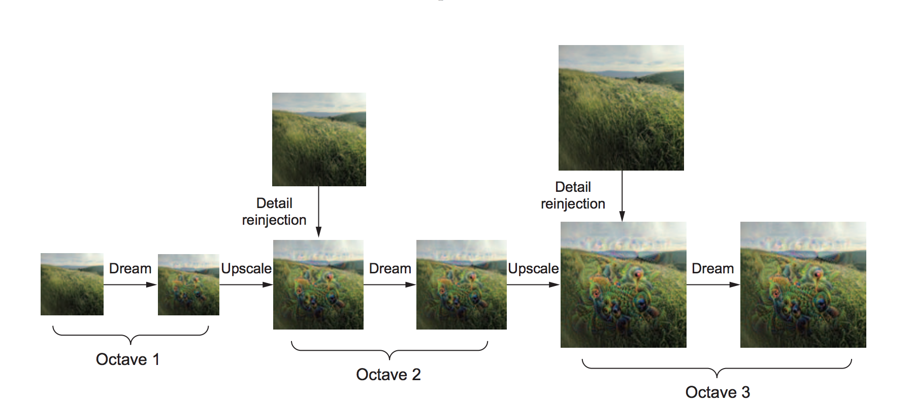
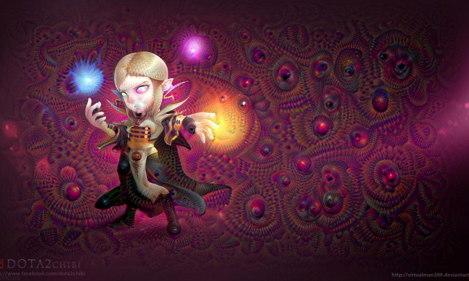
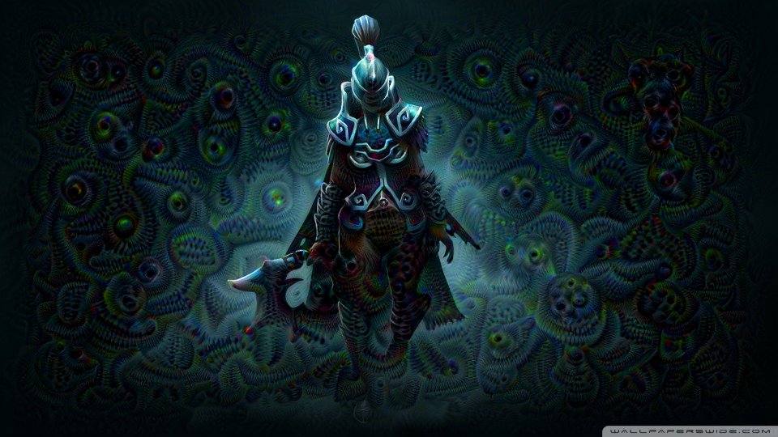

# Deep Dream

by **Alexander Mordvintsev**, **Christopher Olah** and **Mike Tyka**

https://research.googleblog.com/2015/06/inceptionism-going-deeper-into-neural.html

### Short summary

- Deep dream modifies an image to maximize activations of one or serveral layers.
- Deep dream uses octaves as well as lost detail injection to make the end results more real.

### Implementation

The aspiration for neural networks has always been: higher level layers learn higher level features (more generalized). What does it mean to learn? Let's take imagenet for example, the task is to classify an image into 1000 classes of animals and objects. When presented with millions of images of dogs, certain neurons in higher layers of the network is hope learn to "fire", i.e. have higher activations, on dog-shape objects. Deep dream is an experiment to modify a given image to make certain activations higher. The name "dream" is quite misleading, for we also haven't fully understand dreams. It is only named that way because the end results look like vivid images we often see when dreaming.

Deep dream is a process of examining a neural network so first we need one. We pick a fully trained Inception model (v3) trained on image net data. ImageNet potentially produces the best results because of the breadth of the problem,


```python
K.set_learning_phase(0)
model = inception_v3.InceptionV3(weights='imagenet', include_top=False)
```

Secondly, we need to pick the layers,

```python
layer_contributions = {
    'mixed2': 0.2,
    'mixed3': 3.,
    'mixed4': 2.,
    'mixed5': 1.5
}
```
The objective is to find an image `x` that maximize the weighted activations of the above layers (with the above coefficients). Therefore, the loss function is defined as,

```python
layer_dict = {layer.name: layer for layer in model.layers}

loss = K.variable(0.)

for layer_name, coeff in layer_contributions.items():
    activation = layer_dict[layer_name].output

    # if activation shape is mxn then scaling = m * n
    scaling = K.prod(K.cast(K.shape(activation), 'float32'))
    loss += coeff * K.sum(K.square(activation[:, 2:-2, 2:-2, :])) / scaling
```

We start with an image as the input. We calculate the gradient of the loss with respect to this image `x`, then we slighly modify `x` towards the gradient. This is called gradient ascent,

```python
dream = model.input
grads = K.gradients(loss, dream)[0]
grads /= K.maximum(K.mean(K.abs(grads)), 1e-7)
outputs = [loss, grads]
fetch_loss_and_grads = K.function([dream], outputs)

def eval_loss_and_grads(x):
    outs = fetch_loss_and_grads([x])
    loss_value = outs[0]
    grad_values = outs[1]
    return loss_value, grad_values

def gradient_ascent(x, iterations, step, max_loss=None):
    for i in range(iterations):
        loss_value, grad_values = eval_loss_and_grads(x)
        if max_loss is not None and loss_value > max_loss:
            break
        print('...Loss value at', i, ':', loss_value)
        x += step * grad_values
    return x
```

Finally, to make the end results have higher quality, we don't just dream once. We dream in iterations (or octaves). We start with a smaller scale of the input. Dream for a while, then upscale the results and keep repeating until we have high enough resolutions.


```python
img = preprocess_image(base_image_path)

original_shape = img.shape[1:3]

successive_shapes = [original_shape]
for i in range(1, num_octave):
    shape = tuple([int(dim/ (octave_scale ** i)) for dim in original_shape])
    successive_shapes.append(shape)

print(successive_shapes)
successive_shapes = successive_shapes[::-1]
original_img = np.copy(img)
shrunk_original_img = resize_img(img, successive_shapes[0])

for shape in successive_shapes:
    print ('Processing image shape', shape)
    img = resize_img(img, shape)
    img = gradient_ascent(img, iterations=iterations, step=step, max_loss=max_loss)
    upscaled_shrunk_original_img = resize_img(shrunk_original_img, shape)
    same_size_original_img = resize_img(original_img, shape)

    lost_detail = same_size_original_img - upscaled_shrunk_original_img

    img += lost_detail
    shrunk_original_img = resize_img(original_img, shape)
    save_img(img, fname='dream_at_scale_'+str(shape)+'.png')
save_img(img, fname='final_dream.png')
```
 An important trick to **lost detail injection**. To prevent gradient ascent walking too far away from the original image, at the beginning of each octave, we inject the details lost so far by dreaming into the current dream. We can do this because we have the true original image.

 The results look something like this. 




