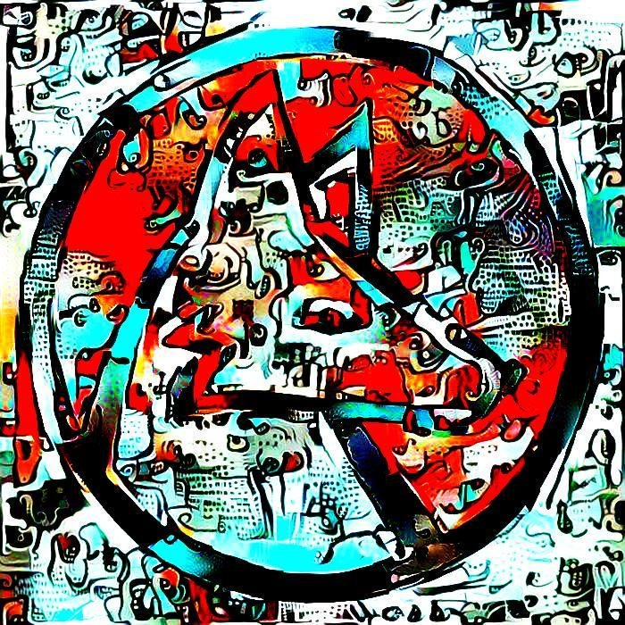
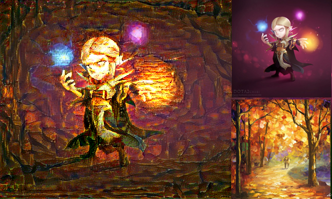
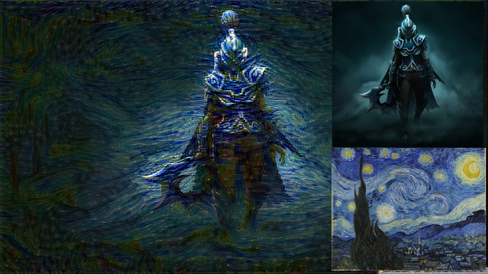

# Neural style transfer

by **Leon A. Gatys**, **Alexander S. Ecker**, and **Matthias Bethge**

https://arxiv.org/pdf/1508.06576.pdf

### Short summary

- Neural style transfer takes a target image and a reference style image, and produces a combined image that has content similar to the target image and style similar to the reference image.
- The algorithm achieves this by minimizing the "content loss" which is defined by the L2 norm between the activation of the combined image and the target image, and the "style loss" which is defined by the L2 norm between the "Gram matrix" of the reference image and the combination image.

### Implementation

Neural style transfer is a method of combining content and style of input images into one final image. The motivation behind this method is that both the content and style of an image is captured in the activations of higher level layer of a network trained on a highly complicated visual task like ImageNet. Specifically, it makes an assumption that if the activations of the l-th layer of the network are the same for two inputs, then the two inputs must be similar to each other in terms of content. Capturing the style is a little bit more interesting,



The "style" of the above image is a little harder to define. We can look at 2 pictures and tell whether or not they have the same style but it's hard to come up with a local rule that achieves the same thing. And here's the most important part of the paper. Empirically, the paper argues that the style of an image can be captured by looking at the **Gram matrix** of the activations of multiple layers. The **Gram** matrix can be thought of as independence matrix, it captures the correlations between the activations of the layers. Like many things in deep learning, there's no concrete proof. It just works well in practice.

We start with a pretrained network, VGG19 on ImageNet,

```python
from keras import backend as K

target_image = K.constant(preprocess_image(target_image_path))
style_reference_image = K.constant(preprocess_image(style_reference_image_path))
combination_image = K.placeholder((1, img_height, img_width, 3))

input_tensor = K.concatenate(
    [target_image, style_reference_image, combination_image], axis=0)
model = vgg19.VGG19(input_tensor=input_tensor, weights='imagenet', include_top=False)
```

The inputs to the network is the target image `target_image_path`, the style reference image `style_reference_image` and the `combination_image`.

The content loss represents the fact that we want our combined picture to look similar to the "base" or the "target image",
```python
def content_loss(base, combination):
    return K.sum(K.square(combination - base))
```

The style loss says to minimize the difference in "style" or the difference in **Gram** matrix of the combined image and the style reference image,
```python
def gram_matrix(x):
    features = K.batch_flatten(K.permute_dimensions(x, (2, 0, 1)))
    gram = K.dot(features, K.transpose(features))
    return gram

def style_loss(style, combination):
    S = gram_matrix(style)
    C = gram_matrix(combination)
    channels = 3
    size = img_height * img_width
    return K.sum(K.square(S - C)) / (4. * (channels **2) * (size ** 2))
```

Finally, we add a regularization term to the loss which forces the combined image to be smooth,

```python

def total_variation_loss(x):
    a = K.square(x[:, :img_height-1, :img_width-1, :] - x[:, 1:, :img_width-1, :])
    b = K.square(x[:, :img_height-1, :img_width-1, :] - x[:, :img_height-1, 1:, :])
    return K.sum(K.pow(a + b, 1.25))
```

Combining all the losses,

```python
outputs_dict = dict([layer.name, layer.output] for layer in model.layers)
content_layer = 'block5_conv2'
style_layers = ['block1_conv1', 'block2_conv1', 'block3_conv1', 'block4_conv1', 'block5_conv1']
total_variation_weight = 1e-4
style_weight = 1.
content_weight = 0.025
loss = K.variable(0.)

layer_features = outputs_dict[content_layer]
target_image_features = layer_features[0, :, :, :]
combination_features = layer_features[2, :, :, :]
loss += content_weight * content_loss(target_image_features, combination_features)

for layer_name in style_layers:
    layer_features = outputs_dict[layer_name]
    style_reference_features = layer_features[1, :, :, :]
    combination_features = layer_features[2, :, :, :]
    sl = style_loss(style_reference_features, combination_features)
    loss += (style_weight/ len(style_layers)) * sl
loss += total_variation_weight * total_variation_loss(combination_image)
```

Now we have our loss function defined, we will use gradient based method to find the combination image that minimizes the loss function. To do this, we need to find the gradient of the loss with respect to the combination image,

```python
grads = K.gradients(loss, combination_image)[0]
featch_loss_and_grads = K.function([combination_image], [loss, grads])
```

We will use `Broyden–Fletcher–Goldfarb–Shannon` algorithm provided by `scipy` library. To use this we need a wrapper class for the gradients and the loss function,

```python
class Evaluator(object):

    def __init__(self):
        self.loss_value = None
        self.grads_values = None

    def loss(self, x):
        assert self.loss_value is None

        x = x.reshape((1, img_height, img_width, 3))
        outs = featch_loss_and_grads([x])

        loss_value = outs[0]
        grad_values = outs[1].flatten().astype('float64')
        self.loss_value = loss_value
        self.grad_values = grad_values
        return self.loss_value

    def grads(self, x):
        assert self.loss_value is not None
        grad_values = np.copy(self.grad_values)
        self.loss_value = None
        self.grad_values = None
        return grad_values

evaluator = Evaluator()
```

Finally, the code to find the combined image,

```python
from scipy.optimize import fmin_l_bfgs_b
from scipy.misc import imsave
import time

result_prefix = 'invoker_2'
iterations = 20

x = preprocess_image(target_image_path)
x = x.flatten()

for i in range(iterations):
    print ('Start of iteration', i)
    start_time = time.time()
    x, min_val, info = fmin_l_bfgs_b(evaluator.loss, x, fprime=evaluator.grads, maxfun=20)
    print('Current loss value :', min_val)
    img = x.copy().reshape((img_height, img_width, 3))
    img = deprocess_image(img)
    fname = result_prefix + '_at_iteration_%d.png' % i
    imsave(fname, img)
    print('Image saved as ', fname)
    end_time = time.time()
    print('Iteration %d completed in %d s' % (i, end_time - start_time))
```

And here are the results,




