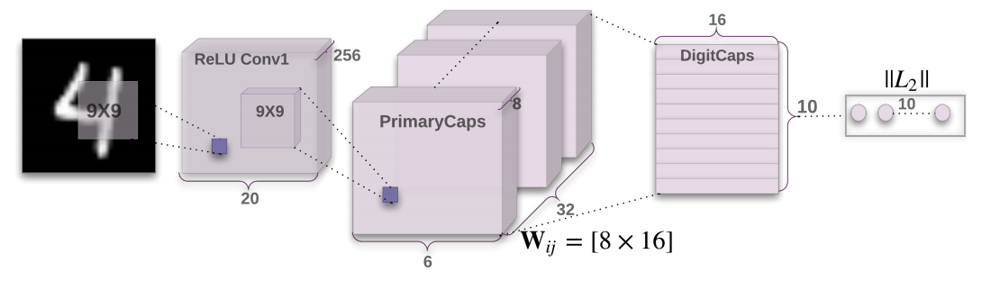
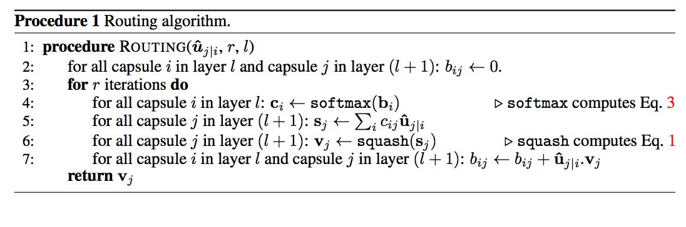
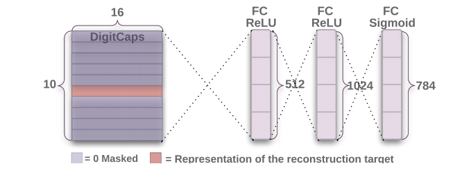

# Dynamic Routing Between Capsules

by **Sara Sabour**, **Nicholas Frosst**, and **Geoffrey Hinton**

https://arxiv.org/abs/1710.09829

Short summary:
- The paper is well-motivated: There is no concept of entities in current neural network architectures, there is no explicit concept of agreements in high dimensional activations.
- The authors propose forming a group of neurons into capsules outputing a vector instead of one single activation. The hope is that each capsule will represent an "entity". The authors propose an algorithm (dynamic routing between capsules) to formalize the ideas of high dimensional aggreement (certain entities tend to go appear together).
- The results is less than convincing. Their implementation of capsule (primary capsule) was equivalent (mathematically) to a convolutional layer. There is no discussion of different squashing functions or why this function is better. The authors evaluate capsule network on MNIST dataset which has minimal input variance. Their performance on CIFAR10 was on par with CNN from 4 years ago. They did not experiment on more complicated benchmark, e.g. ImageNet.

Overall, this paper has good motivation, good intuition leading to an implementation. However, there is no framework justifying this approach. The experimental results aren't strong enough to back the hypothesis. The main contribution of this paper is the hypothesis, and the implementation of the entities agreement.


### Motivation

**The idea of high dimensional agreement**:
How does human see the world? How can human be able to recognize objects so quickly? One hypothesis is that the brain somehow can quickly filters out irrelevant details and fixate on the parts that make up the objects in the scene. And based on the combination and pose of the parts, we can quickly identify the identity of the summation of the parts, and classify it as an object. Anything that has 4 legs and a flat surface is probably a table. Imagine we parameterize a function that can generate all possible 3D objects with shape and size. The dimension of the parameter space must be extremely large. Intuitively, the manifold of all real objects lie in a much lower dimension. All the possible tables in the world must lie very close to each other on this manifold. All that identifies parts of a table must too, e.g. flat surfaces should be close to each other on the manifold. In short, agreement in high dimensional is not conincedental.

**The idea of a capsule**
Currently there is no concept of entities in fully connected layers. Each neuron only outputs one activation number. The idea is to replace neuron with a collection of neurons called capsule. The aspiration is that one capsule unit will represent an entity and will output a vector instead of a number. Ideally, the vector will

1) represents the state of some entity
2) the norm of the vector represents the probability the entity represents in the input


### Implementation details


 

**Architecture details**

- The MNIST input to the network is a 28x28 single channel image
```python
  with tf.name_scope('x_reshape'):
    x_reshape = tf.reshape(input_x, [-1, 28, 28, 1])
```

- The first layer is a convolutional layer with kernel size 9x9 and output channel 256, stride = 1 and padding valid, that means after this layer, the activations become a volume of dimension 20x20x256. ( (28-9)//1 + 1)
```python
  with tf.variable_scope('conv1'):
    # Note: initialization method is not specified in the paper.
    # Note: not sure if the paper used bias
    conv1 = slim.conv2d(x_reshape, 256, [9, 9],
                        padding='VALID',
                        activation_fn=tf.nn.relu,
                        weights_initializer=tf.contrib.layers.xavier_initializer())
```

- The next layer is the primary capsule layer. This layer has a convolutional kernel of 9x9 with stride 2. In the paper, the outputs of this layer consists of 32 volumes (or channel). All of these volumes share the same convolutional kernel (9x9x256 weights). Therefore, each volume will contain 6x6 = 36 of 8 dimensional vectors. ( 6 = (20 - 9) // 2 + 1). And **the hope** is that **somehow**, each of these 8 dimensional vectors represent a capsule, i.e. an entity/pose in high dimensional space. There is no mention of the interpretation or evaluation of how well this implementation play with the initial motivation of capsules. Also, since the output has 32 channels, each has 8 channels. This layer is equivalent to one single convolutional layer with output of 32*8 = 256 channels. This fact is also mentioned in the paper, the implementation is shown below,
```python
  with tf.variable_scope('primary_capsule'):
    u = slim.conv2d(conv1, 32 * 8, [9, 9], stride=2,
                    padding="VALID", activation_fn=None,
                    weights_initializer=tf.contrib.layers.xavier_initializer())
    # At this point, dimension should be 6x6x256
    # reshape to 1152 8D capsules and squash each capsule
    u = tf.reshape(u, [-1, 1, 6*6*32, 1, 8])
    u = squash(u)
```
- Another important thing to note is that the paper uses a squashing function as the activation function. This squashing is one way to implement the idea mentioned earlier, the norm of a capsule should represent the probability that the capsule is present in the input. There is no discussion of alternative activation functions as well as no investigation of how well this activation function work.
\[
squash: R^d \rightarrow [0, 1]^d,
\]
\[
squash(s) = \frac{||s||}{1 + ||s||^2}s
\]
```python
def squash(sj):
    with tf.name_scope('squash'):
      # ||s_j||^2
      sj_sqr = tf.reduce_sum(tf.square(sj), axis=-1, keep_dims=True)

      # ||s_j||^2 / (1. + ||s_j||^2) * (1 / ||s_j||)
      scale = sj_sqr / (1. + sj_sqr) / tf.sqrt(sj_sqr)
    return scale * sj
```
- The next layer is the digit capsule layer. The meat of the paper is how the previous layer (primary capsule) interacts with this layer (digit capsule).
  - The output of the last layers are 6*6*32 = 1152 of 8 dimensional vectors (capsules). We want the output to be 10 n-dimensional vectors, each representing a digit. In the paper, n is chosen to be 16. Each of the 10 16-dimensional vectors should take all 1152 capsules into consideration but should assign higher weights to entities that often go together. This comes back to our motivation that high dimensional agreement is not coincidental. Mathematically,
  \[
  v_j = squash(s_j) = \sum_i c_{ij}W^T_{ij}u_i
  \]
  - $c_{ij} = \frac{exp(b_{ij})}{\sum exp(b_{ik})}$ representing the probability that capsule_i "agrees" with capsule_j. $W_{ij}$ is a transformation that maps the space of capsule i to the space of capsule j. In this example, our input dimension is 8 and output dimension is 16, so naturally $W_{ij}$ is a matrix of dimension (8x16). For each forward pass, the prior $b_{ij}$ are set to 0 and are updated based on the agreement between i and j, $v^T_j(W^T_{ij}u_i)$, the pseudocode for the algorithm is,


 
  - The actual code that implements the idea is shown below,

```python
  with tf.variable_scope('digit_capsule'):
    num_iters = 3

    # For primary cap
    # u has shape [None, 1, 1152, 1, 8] which represents 1152 of 8D capsules
    # w is the weight matrix between the layers. Each matrix has height equal
    # to the output dimension vector, which is 16, width equal to the input
    # dimension vector which is 8. The number of output capsules is 10 and the
    # number of input capsules is 1152.
    w = tf.get_variable('w', shape=[10, 1152, 8, 16])

    # all capsules in the next layer sees all inputs capsule so x10 all input
    # capsules
    u_tile = tf.tile(u, [1, 10, 1, 1, 1])


    # u^_ij = w_ij * u_ij
    # dimension [10, 1152, 1, 16]
    fn_init = tf.zeros([10, 1152, 1, 16])
    u_hat = tf.scan(lambda _, each_u: tf.matmul(each_u, w), u_tile, initializer=fn_init)

    # dimension [10, 1152, 16]
    u_hat = tf.squeeze(u_hat, axis=[3])
    #u_hat = tf.expand_dims(u_hat, 0)

    # There are 1152 capsules in previous layer and 10 capsules in next layer
    b = tf.get_variable('b', shape=[1, 10, 1152], dtype=tf.float32,
                        initializer=tf.zeros_initializer())

    for i in range(num_iters):
      with tf.name_scope('routing_' + str(i)):
        # c = softmax(b) shape = [1, 10, 1152]
        c = tf.nn.softmax(b, dim=1)
        # shape = [1, 10, 1152, 1]
        c = tf.expand_dims(c, axis=-1)

        # s = sum (c_ij u^_ij)
        # u_hat dim = [10, 1152, 16]
        s = tf.reduce_sum(tf.multiply(u_hat, c), axis=[2])
        # s dim = [None, 10, 16]

        v = squash(s)
        v_expand = tf.expand_dims(v, axis=[2])
        #print (v_expand.get_shape())
        #print (u_hat.get_shape())
        # v dim = [None, 10, 16]
        # v expand = [None, 10, 16, 1]
        a = tf.multiply(v_expand, u_hat)
        a = tf.reduce_sum(a, axis=[-1])
        #print(a.get_shape())
        # [None, 10, 1152, 1]

        # agreement between the output of the capsule and the input to the capsule
        # b shape = [1, 10, 1152]
        #a = tf.multiply(v, u_hat)
        b += a
  v_norm = tf.norm(v, ord=2, axis=2, name='digit_caps_norm')
```

- The loss function is another interesting part. Recall that the digit capsule layer outputs 10 16D capsules, whose norms represent the probability that the input is the coresponding digit. Hence, after a forward pass, we have a pmf over the digits. Foe each capsule, the loss function they use (without regularization) is,

\[
L_k = y_k max(0, (0.9 - ||v_k||)^2) + 0.5(1-y_k)max(0, (||v_k||-0.1)^2)
\]
- Where $y_k$ is 1 if the digit is k, and 0 otherwise. Hence, the first term is a "positive reward" and the second term is the "negative reward". If the digit is k and the model gives it low probability then the first term of the loss will be big, if the digit is $l \neq k$, then the second term of the loss will be big if the model gives it high probability. It is not very clear to me why they did not use other more traditional costs like cross entropy. However, I believe this cost is mathematically equivalent to a traditional information metric cost. **TODO(jhoang): figure this out.** The implementation of this cost looks like this,
```python
# loss = T_k max(0, 0.9 - norm(v)) ^ 2 + 0.5 * ( 1 - T_k) max (0, norm(v) - 0.1) ^ 2 + 0.0005*reonstruction_loss
# = max(0, 0.9 - norm(v) * T_k) ^ 2 + 0.5 * max (0, norm(v) * ( 1 - T_k) - 0.1) ^ 2 + 0.0005*reonstruction_loss

# max(0, 0.9 - norm(v)) ^ 2
pos = tf.square(tf.maximum(0.0, 0.9 - tf.reduce_sum(v_norm * label_y, axis=1)))
pos = tf.reduce_mean(pos)

# max (0, norm(v) - 0.1) ^ 2
neg = tf.square(tf.maximum(0.0, tf.reduce_sum(v_norm * (1-label_y), axis=1) - 0.1))
neg = 0.5 * tf.reduce_mean(neg)
```
- Reconstruction as regularization. To force the digit capsule to learn the high dimensional state of the digits, we can generate a 28x28 image from this hidden state and penalize the output of it's too far away from the original input,

 

 ```python
 label_y_ = tf.expand_dims(label_y, axis=2)
  v_out = tf.reshape(label_y_ * v, [-1, 10*16])
  fc = slim.fully_connected(v_out, 512,
                            weights_initializer=tf.truncated_normal_initializer(stddev=0.1),
                            activation_fn=tf.nn.relu)
  fc = slim.fully_connected(fc, 1024,
                            weights_initializer=tf.truncated_normal_initializer(stddev=0.1),
                            activation_fn=tf.nn.relu)
  fc = slim.fully_connected(fc, 784,
                            weights_initializer=tf.truncated_normal_initializer(stddev=0.1),
                            activation_fn=None)
  fc = tf.sigmoid(fc)

  reconstruction = tf.reduce_mean(tf.reduce_sum(tf.square(input_x - fc), axis=-1))
 ```
 - I think this reconstruction regularization method is quite neat and can be used outside of the context.

### Results
