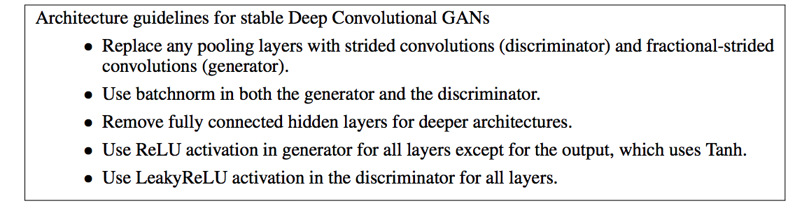
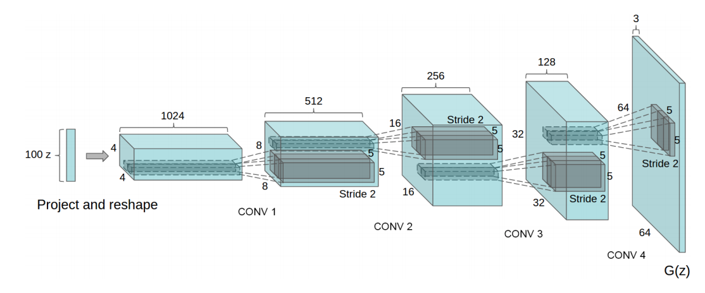

# Unsupervised Representation Learning with Deep Convolutional Generative Adversarial Networks

by **Alec Radford**, **Luke Metz**, and **Soumith Chintala**

https://arxiv.org/abs/1511.06434

### Short summary
- This paper doesn't have a lot of meat. It's the main reason why I decided to put notes for this paper together with the original paper.
- The main and only idea of this paper is using CNN (with some constraints) for both the generator and discriminator. In particular, the constraints are,

In DCGAN, the generator architecture is as follows,

The operations between layers are called transposed convolutional layer. Visually, for a transposed convolution with stride one and no padding, we just pad the original input (blue entries) with zeroes (white entries).

