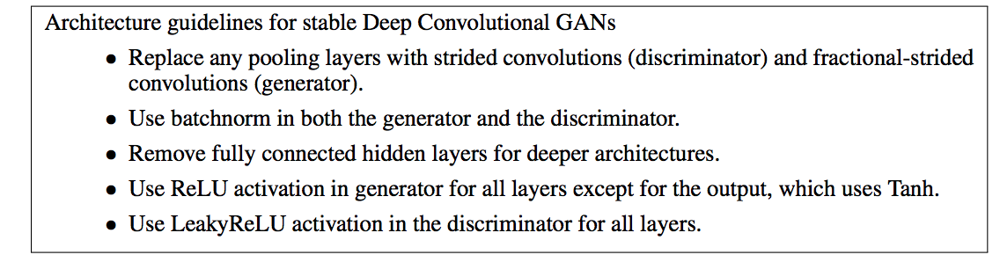
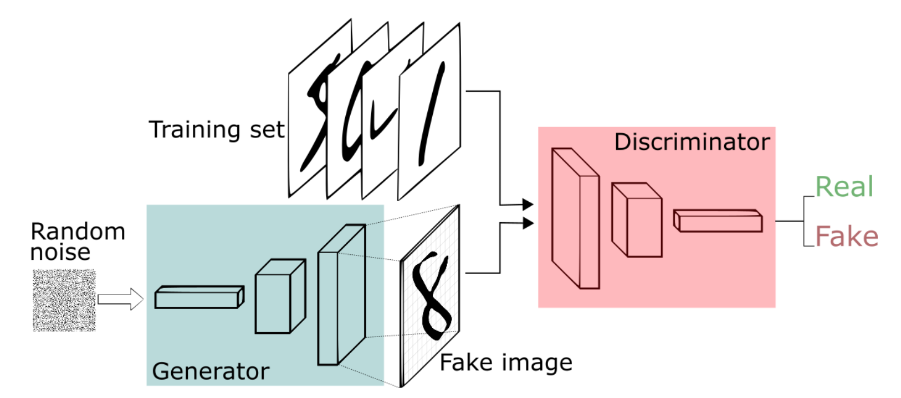
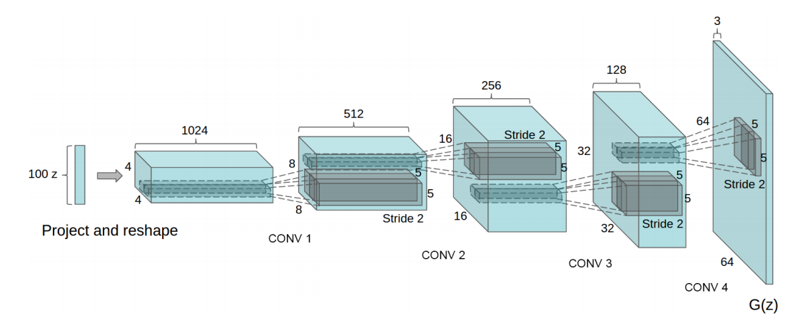

# Generative Adversarial Networks

by **Ian Goodfellow** et al,

https://arxiv.org/pdf/1406.2661.pdf

### Short summary
- The paper introduces a new approach to generative models. The idea is to train two networks jointly, the **generator** that tries to approximate the input distribution and the **discriminator** that tries to differentiate between samples from the **generator** and samples from the true distribution.
- The paper shows that training GAN is equivalent to minimizing the Jensen-Shannon divergence. The paper also proves that under some conditions, theoretically the generator distribution should converge to true distribution.
- GAN is one of the most simple but powerful idea.

# Unsupervised Representation Learning with Deep Convolutional Generative Adversarial Networks

by **Alec Radford**, **Luke Metz**, and **Soumith Chintala**

https://arxiv.org/abs/1511.06434

### Short summary
- This paper doesn't have a lot of meat. It's the main reason why I decided to put notes for this paper together with the original paper.
- The main and only idea of this paper is using CNN (with some constraints) for both the generator and discriminator. In particular, the constraints are,

### Implementation

First, let's revisit the generative problem. Given a dataset $D$ containing $N$ samples drawn from a hidden distribution $p_{data}(x)$. Our task is to somehow draw more samples from this distribution.

The idea of GAN is very simple. In addition to one generator network, add another *feed back* network whose job is to tell the **generator** how to get better. This **discriminator** network learns from the data as well as the output of **generator**, the gradient of this network also flows through the generator, hence pointing the **generator** to the correct direction. Both networks compete, one tries to fake the data, one tries to tell if the data is fake.

Concretely, the generator $G$ tries to learn the function $\mathcal{N} \rightarrow p_{Data}$, the discriminator $D$ tries to learn the function
\[
D(x) =
\begin{cases}
1 & \text{if x} \sim p_{data} \\
0 & \text{if x} \sim p_{G}
\end{cases}
\]

First, we're going to implement the architecture described in Alec et al, then we will follow the prove in Goodfellow et al, to draw the equivalence between GAN and Jensen-Shannon. Finally, we will prove that with enough capacity, the GAN objective will be achieved at least in theory.

In DCGAN, the generator architecture is as follows,

The operations between layers are called transposed convolutional layer. Visually, for a transposed convolution with stride one and no padding, we just pad the original input (blue entries) with zeroes (white entries).

### Results and Discussion
