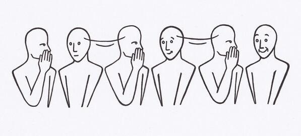

# Batch Normalization

by **Sergey Ioffe** and **Christian Szegedy**

https://arxiv.org/pdf/1502.03167.pdf

### Summary
- Covariate shift is the problem of changing input distribution to a model during training. Internal covariate shift is the problem of changing internal activations of a model during training.
- Batch normalization reduces internal covariate shift by normalizes the activations within one mini batch.
### Implementation
Assume we have some observation $X$ and target $Y$. The covariate shift problem occurs when in the process of learning the conditional distribution $P(Y | X)$, the marginal distribution $P(X)$ changes. Covariate shifting would not be a problem if we can always learn the true conditional distribution simply because the conditional relationship between $Y$ and $X$ doesn't depend on the actual marginal distribution of $X$. Whether or not a picture is a cat shouldn't depend on the fact there are more white cats in the training data. However, in practice, there are a lot of reasons why our approximation $P(Y| X, \theta)$ of $P(Y | X)$ is only suboptimal. The problem could be highly non-convex and gradient-based method never actually converges. 

Imagine the game of telephone where n people sit around a table. A message originates from the first person, each consequent person must paraphrase the sentence without changing the meaning. The moral of the game is that, when the table is big enough, the message usually comes back significantly different. When the chain is long enough, even small transformations at each step can result in a big difference,

### Results
