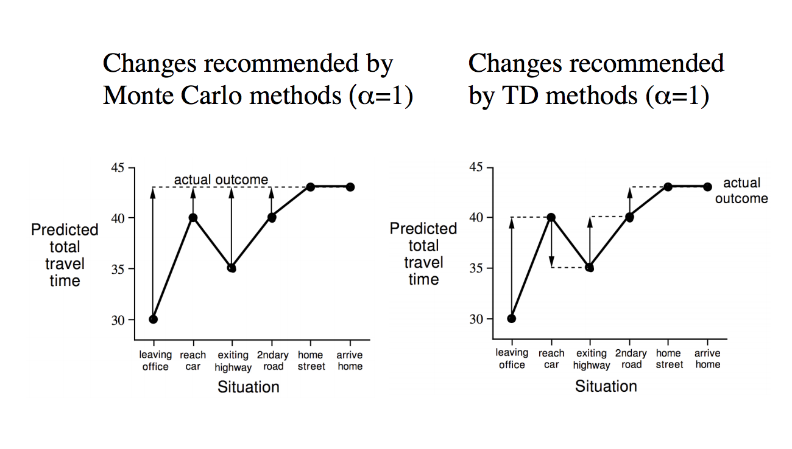
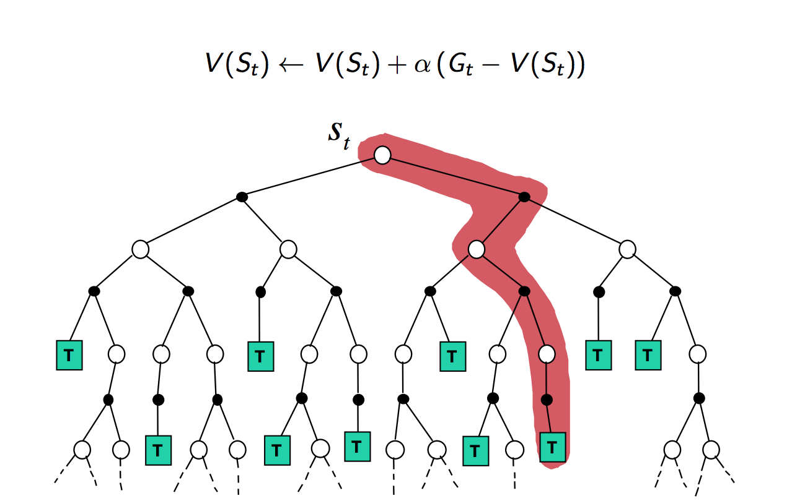
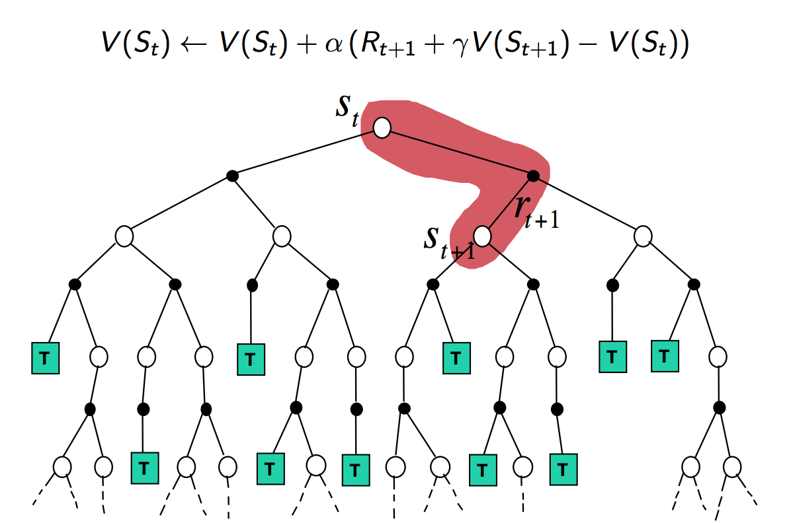
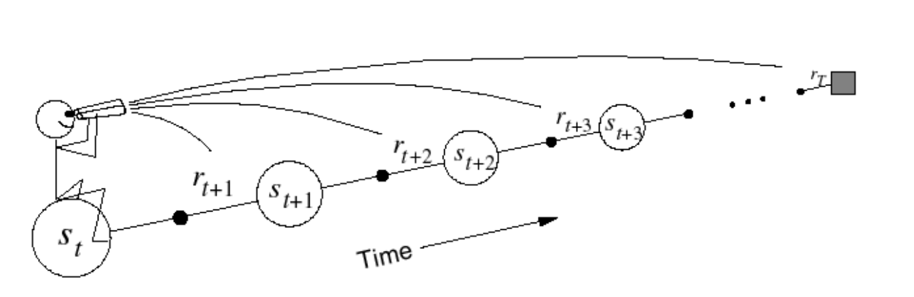
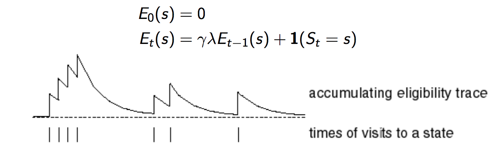
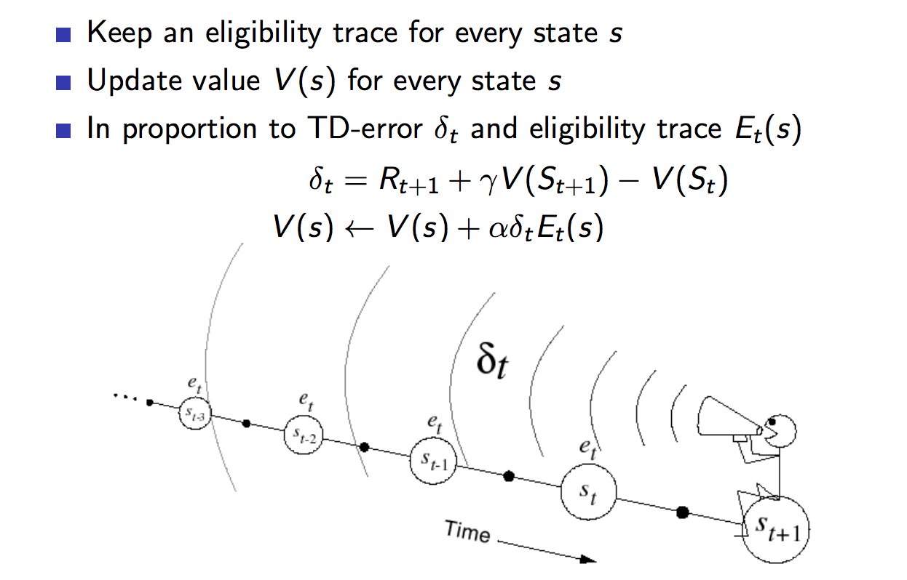
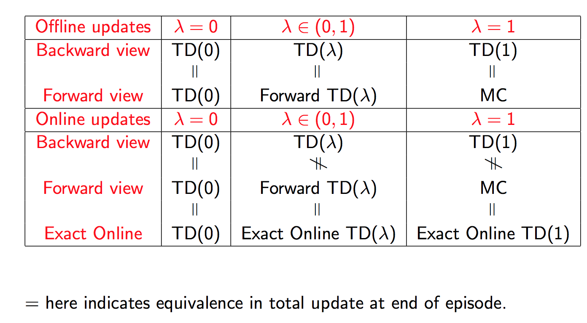
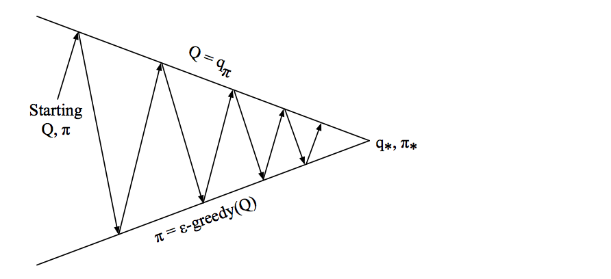
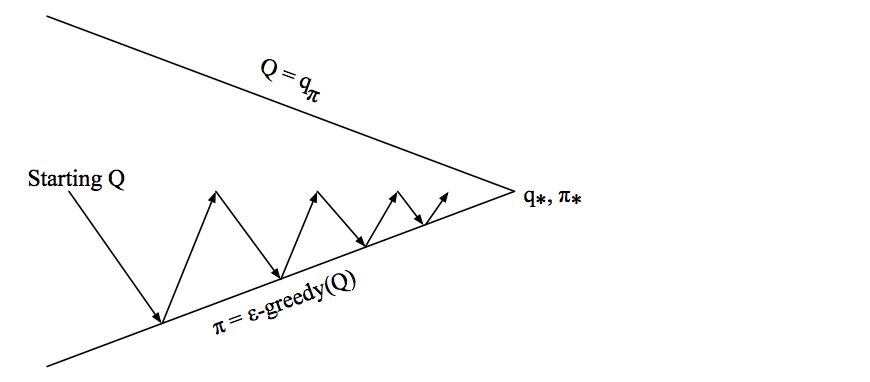

# Classical Reinforcement learning

### Lecture 1 - Intro
- Characteristics of reinforcement learning
1. There is no supervisor
2. Feedback is delayed, not instantaneous
3. Time really matters (sequential, not i.i.d data)
4. Agent's actions affect the subsequent data it receives

- Reward hypothesis

All goals can be described by the maximization of expected cumulative rewards

- Agent and environment

At each step t the agent: Executes action $A_t$, receives observation $O_t$, receives scalar reward $R_t$
At each step t the environment: Receives action $A_t$, emits observation $O_{t+1}$, emits reward $R_{t+1}$

- State

A state is the inner representation used to determine external actions. States are not visible by outside entities. Both agent and environment have states. The current state is a function of the history.

- Markov property

A state S_t is Markovian if and only if $P(S_{t+1} | S_t) = P(S_{t+1} | S_t, .. S_1)$ or the future is independent of the past given the present

- Observable environments

Fully observable environment is one in which the agent observes the state of the environment

- Policy

A policy is the agent's behavior. It is a map from state to action can be both deterministic or stochastic.

- Value function

Value function is a prediction of future reward used to evaluate the goodness/badness of a state. Value function depends on the policy being used, $V_{\pi}(s) = E_{\pi}[R_{t+1} + \gamma R_t + \gamma^2R_{t-1} .. | S_t = s]$

- Model

A model predicts what the environment will do next. $\mathcal{P}$ predicts the next state (of the agent), $\mathcal{R}$ predicts the next reward

- Two types of RL agent: model-free or model-based

### Lecture 2 - MDP

- Environment is fully observable
- States are markovian
- The environment has a state transition matrix that is fully observable by the agent
$\mathcal{P}_{ss'} = P[S_{t+1} = s' | S_t = s]$


Definition: **Markov process** (or **Markov chain**)

- finite set of states
- has a transition probability matrix

Definition: **Markov reward process**

- Is a **Markov process**
- Reward function associated with each state
- Discount factor

Value function: $V(s) = E[G_t | S_t = s]$

Bellman equation $V(s) = E[R_{t+1} + \gamma V(S_{t+1}) | S_t = s]$

Definition: **Markov decision process**

- Is a **Markov reward process**
- has finite set of actions
- transition matrix depends on action
- reward function depends on action

policy is a distribution over actions given a state: $\pi (a | s) = P[A_t = a | S_t = s]$

state-value function: $V_{\pi}(s) = E[G_t | S_t = s]$

action-value function: $q_{\pi}(s, a) = E_{\pi}[G_t | S_t = s, A_t = a]$

Bellman equation for action-value function: $q_{\pi}(s, a) = E_{\pi}[R_{t+1} + \gamma q_{\pi}(s_{t+1}, a_{t+1}) | S_t = s, A_t = a]$

Bellman expectation equation:

$V_{\pi}(s) = \sum_{a \in A} \pi(a | s) q_{\pi}(s, a)$

$q_{\pi}(s, a) = R^{a}_s + \sum_{s' \in S}P^{a}_{ss'}(v_{\pi}(s'))$

Finding the optimal policy $pi^* = 1$ if $a = argmax_a q_{\pi}(s, a)$ and 0 otherwise

### Lecture 3 - Planning by dynamic programming

Idea: solve 2 smaller problems: policy evaluation (finding state value function given a policy) and policy improvement. Then we can start out with a random policy, then evaluate then improve until convergent.

Iterative policy evaluation. State with all 0 state value function. For each state, use bellman expectation equation to find the state value function. Keep iterating until convergent

```python

def policy_eval(policy, env, discount_factor=1.0, theta=0.00001):
    """
    Evaluate a policy given an environment and a full description of the environment's dynamics.

    Args:
        policy: [S, A] shaped matrix representing the policy.
        env: OpenAI env. env.P represents the transition probabilities of the environment.
            env.P[s][a] is a list of transition tuples (prob, next_state, reward, done).
            env.nS is a number of states in the environment.
            env.nA is a number of actions in the environment.
        theta: We stop evaluation once our value function change is less than theta for all states.
        discount_factor: Gamma discount factor.

    Returns:
        Vector of length env.nS representing the value function.
    """
    # Start with a random (all 0) value function
    V = np.zeros(env.nS)
    while True:
        delta = 0
        # For each state, perform a "full backup"
        for s in range(env.nS):
            v = 0
            # Look at the possible next actions
            for a, action_prob in enumerate(policy[s]):
                # For each action, look at the possible next states...
                for  prob, next_state, reward, done in env.P[s][a]:
                    # Calculate the expected value
                    v += action_prob * prob * (reward + discount_factor * V[next_state])
            # How much our value function changed (across any states)
            delta = max(delta, np.abs(v - V[s]))
            V[s] = v
        # Stop evaluating once our value function change is below a threshold
        if delta < theta:
            break
    return np.array(V)
```

Policy improvement. Improve a policy greedily with respect to the state-value function

```python
def policy_improvement(env, policy_eval_fn=policy_eval, discount_factor=1.0):
    """
    Policy Improvement Algorithm. Iteratively evaluates and improves a policy
    until an optimal policy is found.

    Args:
        env: The OpenAI envrionment.
        policy_eval_fn: Policy Evaluation function that takes 3 arguments:
            policy, env, discount_factor.
        discount_factor: gamma discount factor.

    Returns:
        A tuple (policy, V).
        policy is the optimal policy, a matrix of shape [S, A] where each state s
        contains a valid probability distribution over actions.
        V is the value function for the optimal policy.

    """
    # Start with a random policy
    policy = np.ones([env.nS, env.nA]) / env.nA

    while True:
        # Evaluate the current policy
        V = policy_eval_fn(policy, env, discount_factor)

        # Will be set to false if we make any changes to the policy
        policy_stable = True

        # For each state...
        for s in range(env.nS):
            # The best action we would take under the currect policy
            chosen_a = np.argmax(policy[s])

            # Find the best action by one-step lookahead
            # Ties are resolved arbitarily
            action_values = np.zeros(env.nA)
            for a in range(env.nA):
                for prob, next_state, reward, done in env.P[s][a]:
                    action_values[a] += prob * (reward + discount_factor * V[next_state])
            best_a = np.argmax(action_values)

            # Greedily update the policy
            if chosen_a != best_a:
                policy_stable = False
            policy[s] = np.eye(env.nA)[best_a]

        # If the policy is stable we've found an optimal policy. Return it
        if policy_stable:
            return policy, V
```

Value iteration

Idea: if we know solution to all subproblems $V^{*}(s')$ then we know the solution for $V^*(s)$. We can keep iterating until convergent.

```python
def value_iteration(env, theta=0.0001, discount_factor=1.0):
    """
    Value Iteration Algorithm.

    Args:
        env: OpenAI env. env.P represents the transition probabilities of the environment.
            env.P[s][a] is a list of transition tuples (prob, next_state, reward, done).
            env.nS is a number of states in the environment.
            env.nA is a number of actions in the environment.
        theta: We stop evaluation once our value function change is less than theta for all states.
        discount_factor: Gamma discount factor.

    Returns:
        A tuple (policy, V) of the optimal policy and the optimal value function.
    """

    def one_step_lookahead(state, V):
        """
        Helper function to calculate the value for all action in a given state.

        Args:
            state: The state to consider (int)
            V: The value to use as an estimator, Vector of length env.nS

        Returns:
            A vector of length env.nA containing the expected value of each action.
        """
        A = np.zeros(env.nA)
        for a in range(env.nA):
            for prob, next_state, reward, done in env.P[state][a]:
                A[a] += prob * (reward + discount_factor * V[next_state])
        return A

    V = np.zeros(env.nS)
    while True:
        # Stopping condition
        delta = 0
        # Update each state...
        for s in range(env.nS):
            # Do a one-step lookahead to find the best action
            A = one_step_lookahead(s, V)
            best_action_value = np.max(A)
            # Calculate delta across all states seen so far
            delta = max(delta, np.abs(best_action_value - V[s]))
            # Update the value function
            V[s] = best_action_value
        # Check if we can stop
        if delta < theta:
            break

    # Create a deterministic policy using the optimal value function
    policy = np.zeros([env.nS, env.nA])
    for s in range(env.nS):
        # One step lookahead to find the best action for this state
        A = one_step_lookahead(s, V)
        best_action = np.argmax(A)
        # Always take the best action
        policy[s, best_action] = 1.0

    return policy, V

```

### Lecture 4 - Model free prediction

Model free: no knowledge of transition matrix & reward function

Monte-Carlo reinforcement learning

idea: similar to policy iteration, given $\pi$ evaluate policy by approximate the expected value by empirical mean,

$V_{\pi}(s) = E[G_t | S_t = s]$

Can only learn from episodic MDP (MDP that always finishes after finite number of steps)

First visit Monte Carlo policy Evaluation

- To evaluate state s
- First time t that state s is visited in an episode,
- Increment N(s) ++
- Increment total return S(s) = S(s) + G_t
- V(s) = S(s) / N(s) -> true value

Every visit Monte Carlo policy evaluation

- Same as first visit except do the same thing for everytime state s is visited

Alternatively, we can update V(s) incrementally without keeping track of the sum S(s),

$V(s) = V(s) + 1/N(s) (G_t - V(s))$

This updates V(s) to the actual return $G_t$

Temporal difference learning (TD) (for state value estimation) updates V(s) to an estimate. For example TD(0) updates V(s) to $R_{t+1} + \gamma V(s_{t+1})$

$V(S_t) = V(S_t) + \alpha (R_{t+1} + \gamma V(S_{t+1}) - V(S_t))$

MC vs TD



TD learns online so it can learn without knowing the final outcome

Because $v_{\pi}(S_t) = E[G_t | S_t]$ then $G_t$ is an unbiased estimator of the true value function (MC incremental update)

Because $v_{\pi}(S_t) = E[R_{t+1} + \gamma v_{\pi}(S_{t+1})| S_t]$ so $R_{t+1} + \gamma v_{\pi}(S_{t+1})$ is an unbiased estimator of the true value function

However, if we replace the true value function $v_{\pi}(S_{t+1})$ with an estimate $V(S_{t+1})$ then the estimator is biased, so TD(0) is biased

--> bias/variance tradeoff (MC is unbiased but high variance, TD(0) is low variance but some biased)





If we replace 1 step ahead by n-step ahead then we have n-step temporal difference learning

$G^{(n)}_t = R_{t+1} + \gamma R_{t+2} + .. + \gamma^nV(S_{t+n})$

forward $TD(\lambda)$, idea is to combine all 1, 2, 3, ... n, .. steps ahead with weights

$G^{\lambda}_t = (1-\lambda)\sum^{\infty}_{n}\lambda^n G^{(n)}_t$



However, need to see terminal state

Backward $TD(\lambda)$ same theory but update online

Egilibility trace








### Lecture 5 - Model free control

on-policy learning: Learn about policy $\pi$ from experience from policy $\pi$

off policy learning: Learng about policy $\pi$ from experience from policy $\tau$

model-free policy iteration: use $TD(\lambda)$ to do policy evaluation then use $\pi'(s) = argmax_a (Q(s, a))$ as policy improvement (this is model-free)

$\varepsilon$-Greedy exploration

So far, policy is too greedy, i.e. always pick action with best action-value. $\varepsilon$-Greedy picks a random state with probability $\varepsilon$

Note: need to prove $\varepsilon$-Greedy is really an improvement

MC policy iteration
- fully evaluate value function
- improve policy


MC control
- estimate value function
- improve policy


However, we want randomness to slowly disappear as we approach the optimal policy

GLIE conditions (Greedy in the limit with infinite exploration)
  - all state action pairs are explored infinitely many times
  - the policy converges to a greedy policy


### Lecture 7 - Policy gradient method

value-based
- learnt value functions
- policy is derived from value functions

policy-based
- learnt policy
- no value function

actor-critic
- learnt policy
- learnt value function

policy-based:
pros
- better convergence properties
- effective in high dimensional or continuous action spaces
- can learn stochastic policies
cons
- typically converge to local minimum
- evaluating a policy is typically inefficient and high variance
