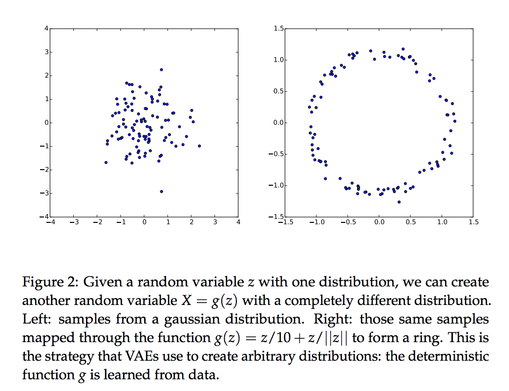
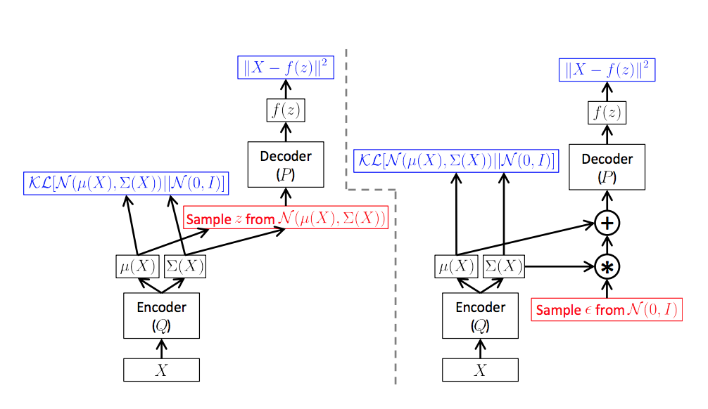
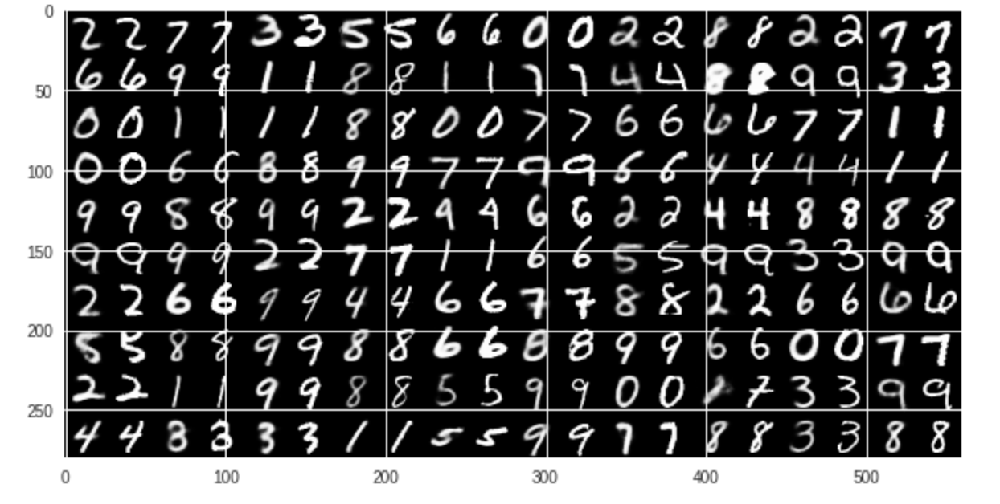
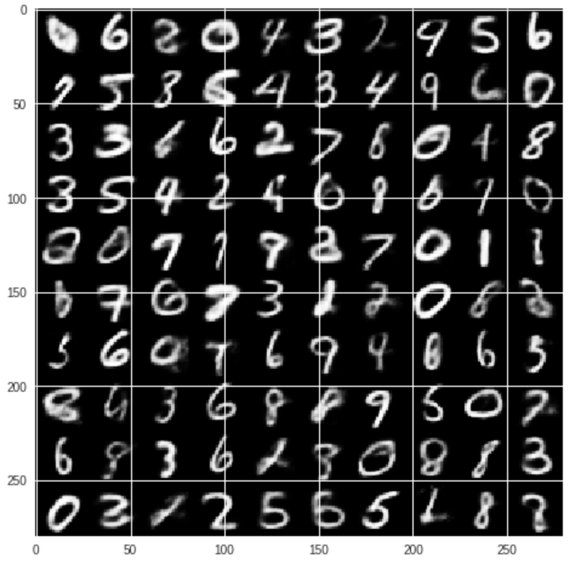
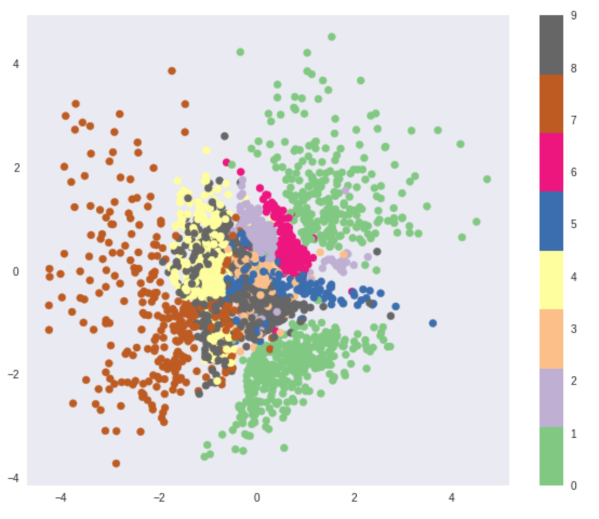

# Variational Autoencoder (VAE)

by **Diederik P. Kingma** and **Max Welling**

https://arxiv.org/pdf/1312.6114.pdf

### Short summary

- The paper combines the traditional variational Bayes with neural networks. In particular, instead of the intractably approach by tradiational variational Bayes, the paper proposes an approach to estimate the variational lower bound using neural networks. In order for gradient descent to work, the paper introduce the **reparameterization trick** which pushes the stochastic operation of sampling out to the input, thus enabling the gradient to flow through the networks.


### Variational Autoencoder
Imagine you want to write a digit from 0-9 on a piece of paper. You first pick a pen, pick a digit then write it. The appearance of the digit on the paper depends on the kind of pen, the color of the ink, what digit you pick, etc. In generative models, this information is called latent variable.

We can state our generative problem as follows. Given a dataset  are  i.i.d samples of a random variable  drawn from a hidden distribution. We further assume there is a latent variable  and the hidden distribution is such that . The problem is to draw more samples from this hidden distribution.

However, different tasks require a completely different structure of the latent space . Generating a digit requires different latent information than generating a song. One interesting hypothesis is that for any latent distribution, there exists a deterministic transformation that maps a normal distribution to the latent one.



Based on this insight, we can somewhat safely start with . Plugging this back to the first equation gives, . One approach to solve this integral is using the Monte Carlo approximation,
\[
P(X) = \frac{1}{n}\sum_i P(X|Z=z_i)
\]
However, for high dimensional problem, n must be extremely larg for this approximationto be close to ground truth. The key idea in variational method is that for the most part  will be nearly zero. So, we want to look for the "important" region in the space of  by having another model  proposing the values of z that are likely to produce ,

\[
<p align="center"></p>
\]
\[
<p align="center"></p>
\]

Therefore,  is the evidence lower bound (ELBO) of the marginal likelihood. Note, the variatonal lower bound can only be as good as our estimation of  using . In summary, to estimate the , we first need to estimate , sample , then estimate . The first part is called the **encoder** which encodes the input into a hidden state. The second part is called the **decoder**, which given the hidden state, infers the input. The two parts combined is called [autoencoder](https://en.wikipedia.org/wiki/Autoencoder), (hence the name variational autoencoder).

However, in order to use learn encoder and decoder jointly using gradient based methods, all operations must be differentible. The sampling operation in the middle of the encoder and decoder is not. The paper introduces a technique called **reparameterization trick** which pushes the sampling operation to the input layer. It works by sampling . If the **encoder**  produces , then the input to the **decoder** will then be .



### Implementation

Let's look at an example using MNIST dataset.

- The encoder takes the 28x28 and produces a n-dimensional mean and variance for z (to ensure variance is positive we predict log  instead, then  is positive )
```python
with tf.variable_scope('encoder'):
  fc = slim.fully_connected(self.input_x, 512, activation_fn=tf.nn.relu)
  fc = slim.fully_connected(fc, 384, activation_fn=tf.nn.relu)
  fc = slim.fully_connected(fc, 256, activation_fn=tf.nn.relu)
  mu = slim.fully_connected(fc, 10, activation_fn=None)
  log_sigma = slim.fully_connected(fc, 10, activation_fn=None)
```
- Reparameterization trick, first sample , then scale ,
```python
with tf.variable_scope('z'):
  eps = tf.random_normal(shape=tf.shape(log_sigma), mean=0, stddev=1, dtype=tf.float32)
  self.z = mu + tf.sqrt(tf.exp(log_sigma)) * eps
```
- The decoder takes  then tries to reproduce input ,
```python
with tf.variable_scope('decoder'):
  dec = slim.fully_connected(self.z, 256, activation_fn=tf.nn.relu)
  dec = slim.fully_connected(dec, 384, activation_fn=tf.nn.relu)
  dec = slim.fully_connected(dec, 512, activation_fn=tf.nn.relu)
  dec = slim.fully_connected(dec, 784, activation_fn=None)
```
- Our objective is to **maximize** the evidence lower bound (ELBO),
\[ \mathcal{L}(Q_{\theta}, X, Z) = E_{x \sim D}[E_{z\sim Q_{\theta(Z|X=x)}}[logP(X|Z=z)] - D_{KL}(Q_{\theta}(Z|X=x) || P(Z))] \]
So,
\[
<p align="center"></p>
\]

- The implementation of the cross entropy can be as simple as,
```python
self.rec = tf.reduce_mean(tf.reduce_sum(
tf.nn.sigmoid_cross_entropy_with_logits(logits=dec, labels=self.input_x), 1))
```
- Since we assume Gaussian for  and , the KL loss can be calculated in closed form,
\[
<p align="center"></p>
\]

```python
self.kl_loss = tf.reduce_mean(0.5 * tf.reduce_sum(
tf.exp(log_sigma) + tf.square(mu) - 1. - log_sigma, 1))
```
- The total loss would just be the sum of the two losses
```python
 self.loss = tf.reduce_mean(self.rec + self.kl_loss)
 ```

 ### Results and Discussion
  
 - Here is the results of reconstruction for 100 random images after 10 minutes of training (10000 iterations, with batch size = 100, learning rate = 1e-3, dimension of z = 10). Assume the columns are 0-indexed, then the even columns contain reconstructed images and the odd columns contain real images.

 
 - Here are the digits generated by the same model from a gaussian latent space.
 - One interesting observation in training VAE is that: initially, both reconstruction loss and KL loss go down. At one point, KL loss starts going up while total loss still goes down. To understand this phenomenon, notice that in a correctly trained VAE and with structured data, KL loss cannot be 0. If KL loss equals 0, it means there is no structured subspace of the prior distribution for the latent variable. Or, the data is almost completely random. At first, both  and  start out to be random, so both losses go down as  gets good at producing the average of the data, and  gets good at finding the subspace in the latent space. After this phase,  and  start making trade-off. Specifically, if  allows more mass in the subspace, more noise will be generated by  hence the reconstruction loss will go up and vice versa.
 
 - To make things more interesting, we can train a different model with laten dimension = 2 and visualize it,

- If we sample spatially from the 2D gaussian of the latent space and with each value , we generate a digit, then the top down view looks something like the picture above. We can see that the latent space encodes the skewness of the digits.

- If we repeat the same sampling mechanism and now encode the digits as colors, we can see that from the original Gaussian, the encoder networks has learnt a non-linear transformation that transoforms the Gaussian into different subspaces encoding different digits.

That concludes my summary and experiments with the original VAE, more theoretical analysis as well as experiments with recent variations to come.
